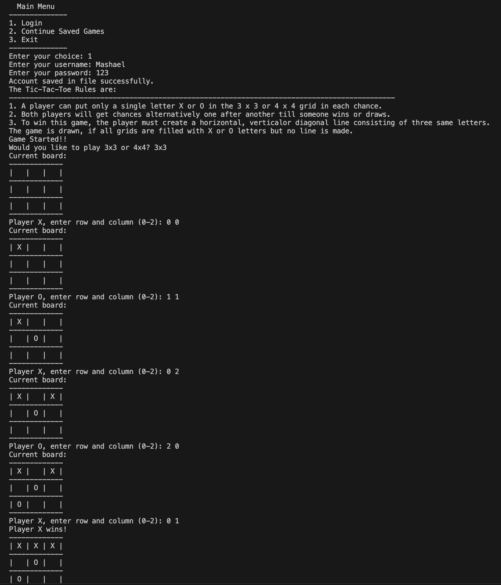

# Tic-Tac-Toe Game (C++)

## Overview
This project is a console-based Tic-Tac-Toe game developed in C++.  
It supports both 3x3 and 4x4 game modes and includes a simple player login/continue menu.

---

## Features
- 3x3 Tic-Tac-Toe mode
- 4x4 Tic-Tac-Toe mode
- Player account input
- Continue saved game option
- Input validation
- Win and draw detection
- Console-based game board display

---

## Technologies Used
- C++
- Standard Input/Output
- Classes and Objects

---

## Project Structure
```text
Tic-Tac-Toe-CPP/
│
├── src/
│   └── main.cpp
│
├── screenshots/
│   └── gameplay.png
│
└── README.md
```

---

## How to Run

Compile the program:

```bash
g++ src/main.cpp -o tic_tac_toe
```

Run the program:

```bash
./tic_tac_toe
```

On Windows:

```bash
tic_tac_toe.exe
```

---

## Screenshot



---

## Authors
Mashael Saeed
Sararh Elshiaty
Seifeldin Elshiaty
